*This project has been created as part of the 42 curriculum by yotsurud, tamatsuu.*

## overview
- [Description](#description)
- [Instructions](#instructions)
- [Resources](#resources)
- [Features](#features)
- [Implementation Details](#implementation_details)
- [file_sample](#file_sample)
- [Examples](#examples)

## Description

The goal of this project is to implement ray tracing.
In simple terms, ray tracing is a technique for tracing light rays. By simulating the intensity, angle, refraction, and reflection of light emitted from a light source using a computer, it is possible to render images that closely resemble the real world.

## Instructions

### Installations

 - `git clone <repository of this project>`<br>
 - `cd project-name`

### Download minilibx

 - `download minilibx files from project page, and put it in the root of this project directory.`

### Compilation

 - `make`<br>
 - `make bonus`

### Run

 - `./miniRT scene/<filename>.rt`<br>
 - `./miniRT_bonus scene/<filename>.rt`

### Close window

 - `ESC button`<br>
 - `click x mark of the window.`<br>
 - `ctrl-C`

## Resources
 - https://inzkyk.xyz/ray_tracing_in_one_weekend/
 - https://jun-networks.hatenablog.com/entry/2021/04/02/043216
 - https://www.youtube.com/watch?v=RIgc5J_ZGu8&list=PLAqGIYgEAxrUO6ODA0pnLkM2UOijerFPv

## Features
 - Mandatory part
	 - Ambient lighting
	 - Camera
	 - Light
	 - Sphere
	 - Plane
	 - Cylinder
 - Bonus part
	 - Specular reflection
	 - color disruption: checkerboard pattern
	 - Colored and multi-spot lights
	 - Another object: cone
	 - Handle bump map texture: earth.xpm
 - Additional Features
	 - Anti-Aliasing
	 - Image Texture
	 - Light Attenuation
	 - Roughness

## Implementation_Details

### Ambient lighting
### Camera
### Light
### Sphere

## file_Sample
```bash
# Ambient light
###     ratio           rgb
A       0.1             255,255,255

# Camera
###     xyz             vector          degree                
C       0,-5,-60         0,0,1           40

# Light
###     xyz             ratio           rgb
L       15,15,-15		0.5				255,255,255

# Sphere
###     xyx             diameter        rgb
sp      0,0,0         	10              255,0,0

# Plane
###     xyz             vector          rgb	
pl      0,-20,0       	0,1,0           0,255,0

# Cylinder
###     xyz             vector          diameter        height          rgb	
cy      10,0,0			0,1.0,0.0		7.2            	21.42           0,0,255
```

## Examples

### [Mandatory part] ###
- ### Symple Scene
 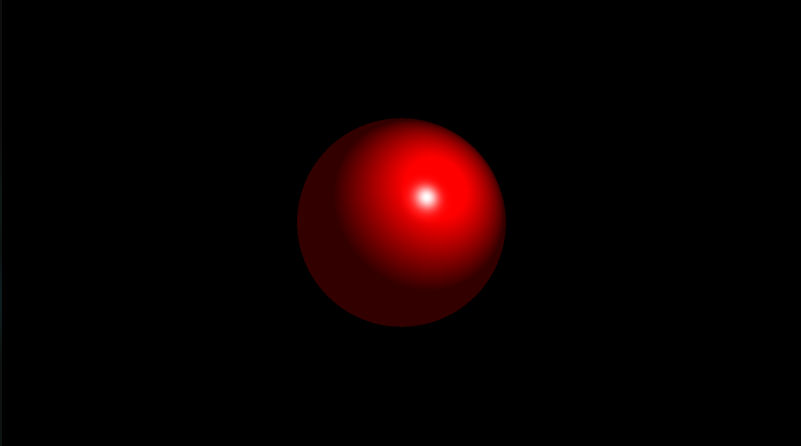
 <br>*Sphere*

- ### Ambient Light
 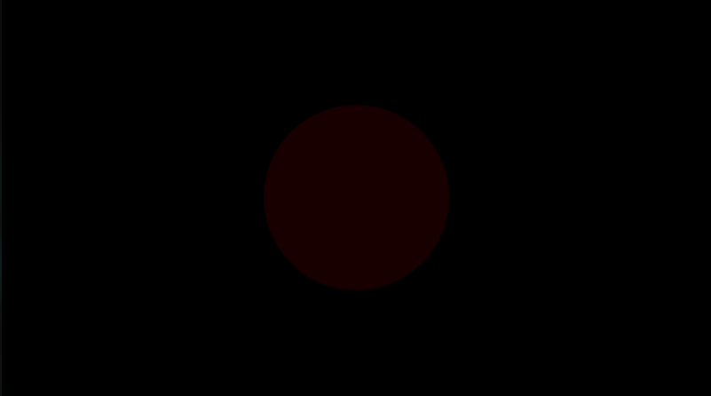

- ### Light Position
<p>
 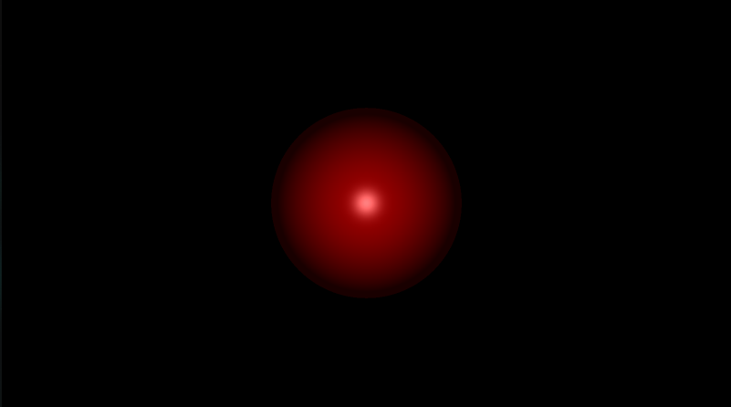
 <br>
 <em>Fromt and Back</em>
</p>
<p>
 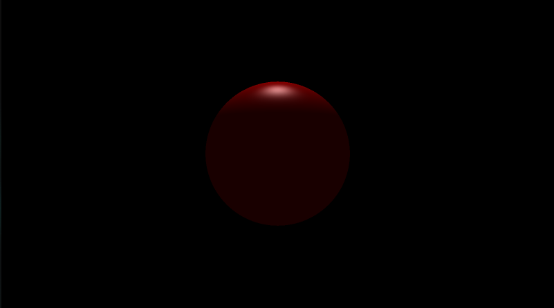
 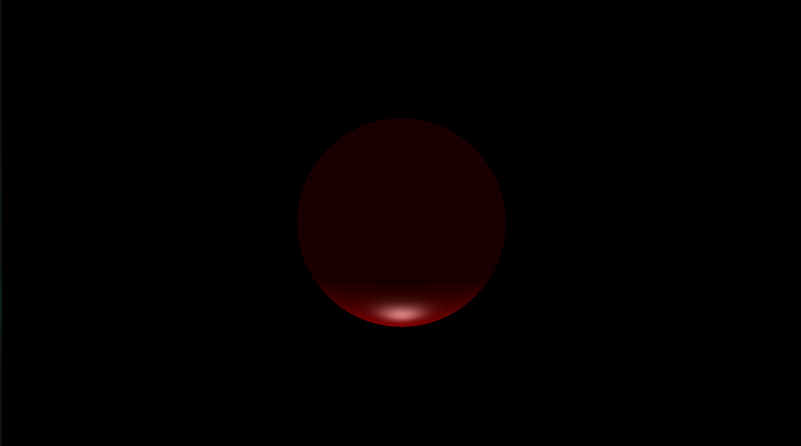<br>
 <em>Top and Bottom</em>
</p>
<p>
 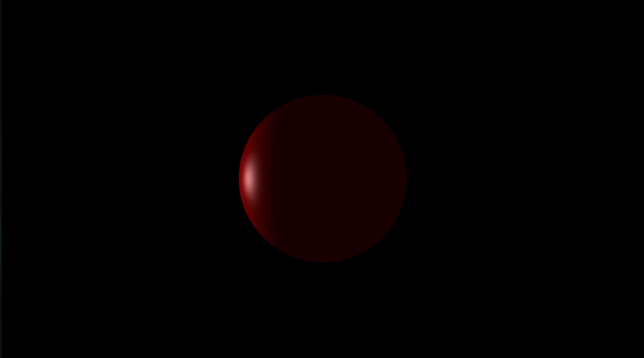
 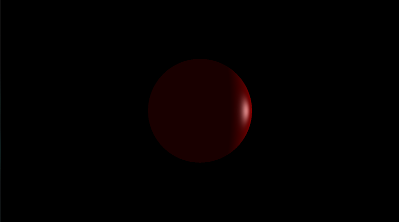<br>
 <em>Left and Right</em>
</p>
<p>
 <br>
 <em>Inside</em>
</p>

- ### Objects [Mandatory part]

 <br>
 *Sphere*

 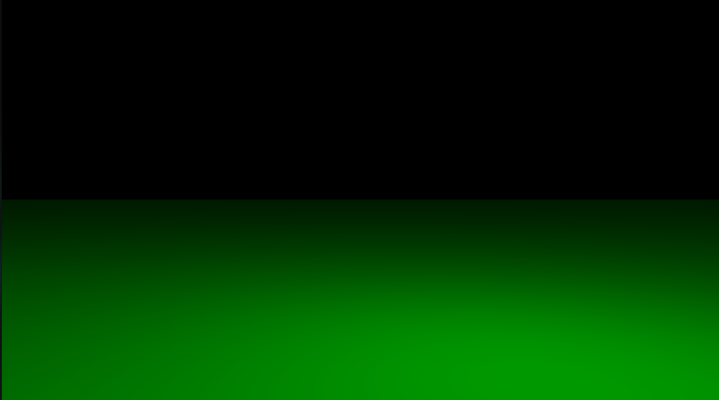"<br>
 *Plane*

 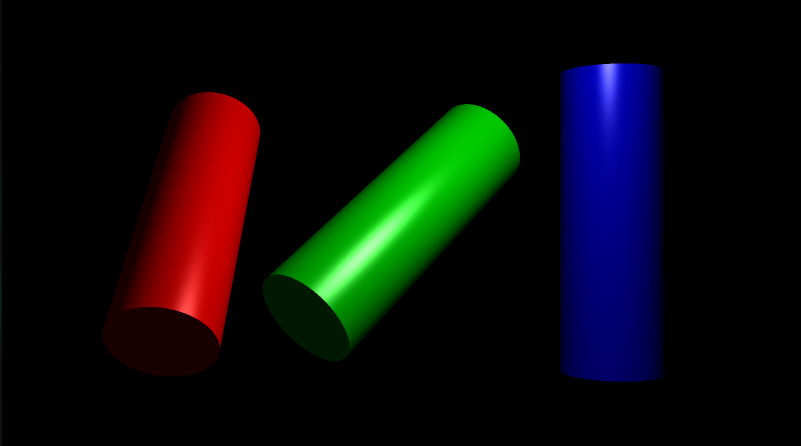<br>
 *Cylinder*

### [Bonus part] ###

- ### Specular reflection
 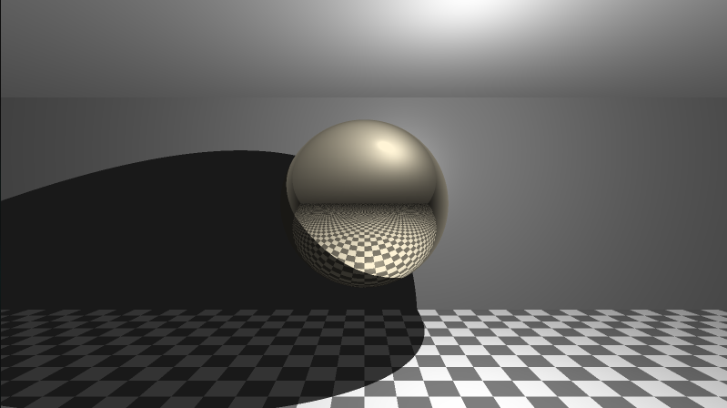

- ### Checker
 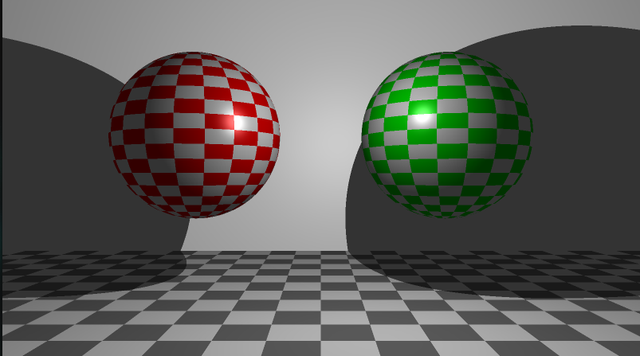

- ### Multi spot-lights
 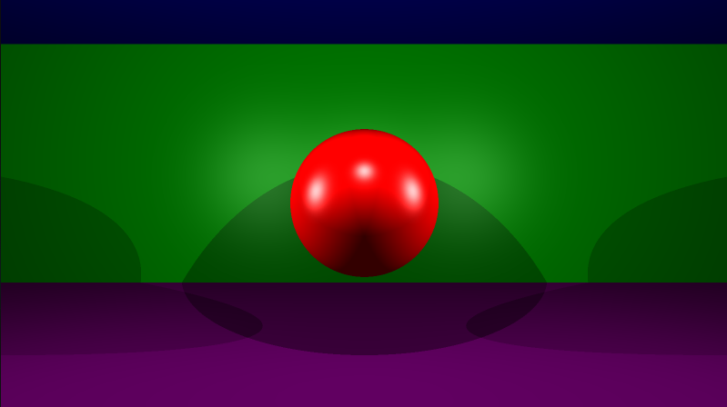

- ### Cone
 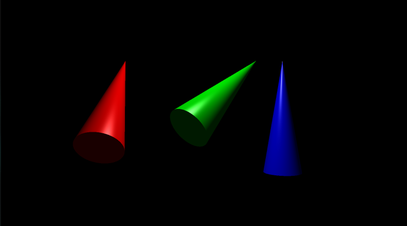

- ### Handle bump map texture
 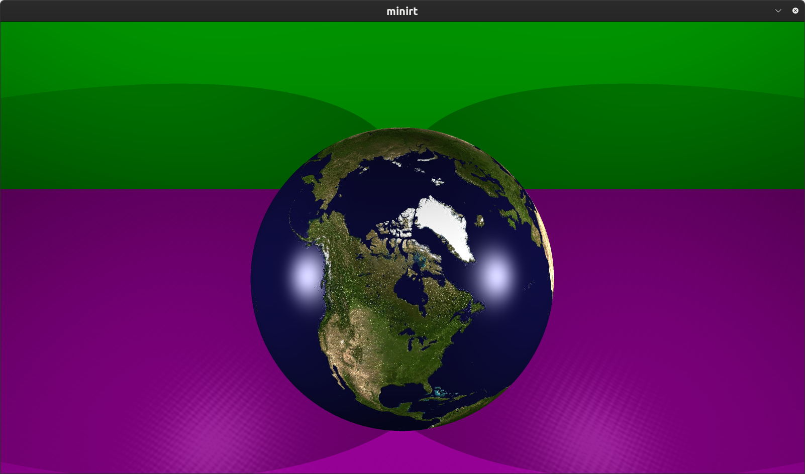

 
### Mixed
<p>
 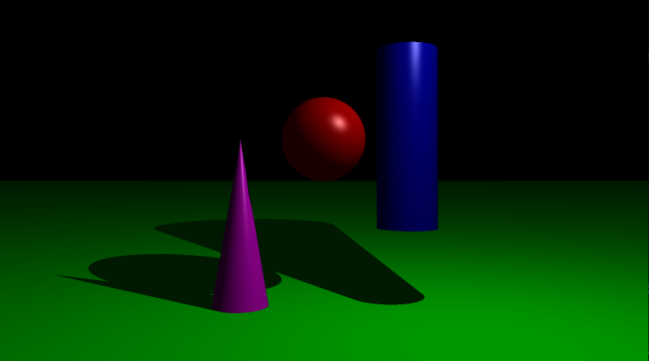<br><br>
 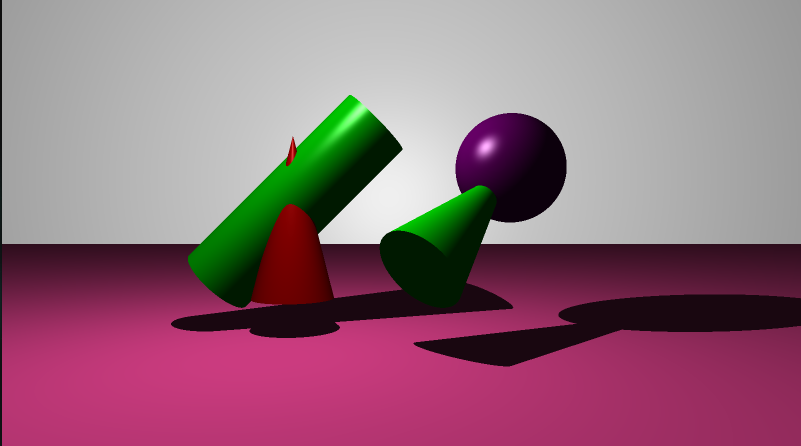<br><br>
 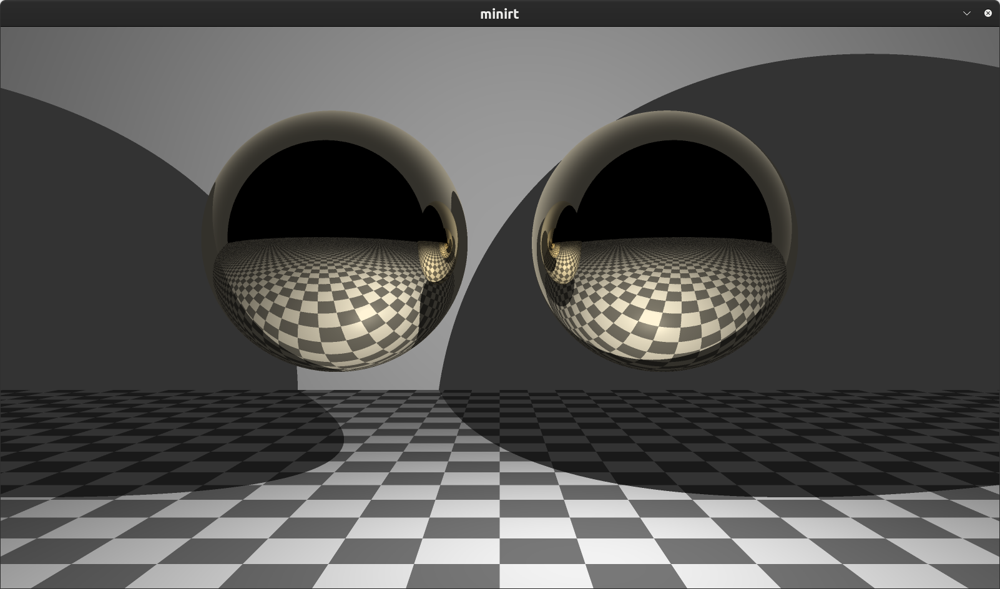<br><br>
 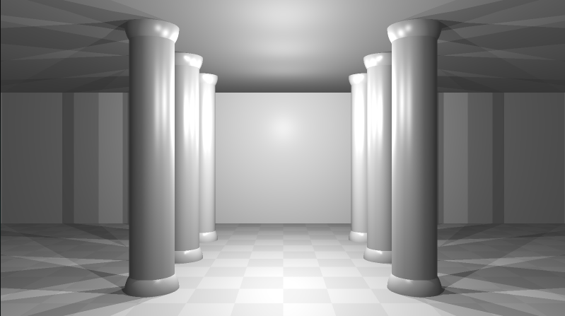
</p>
