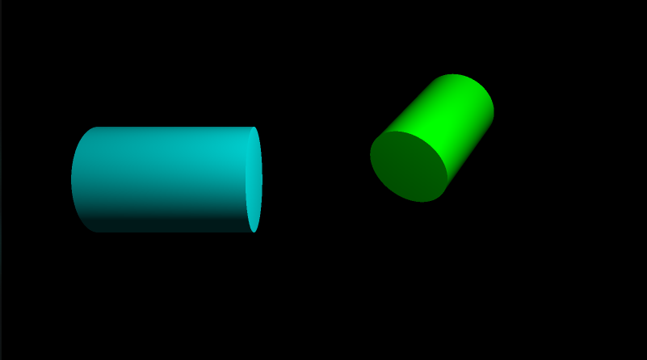
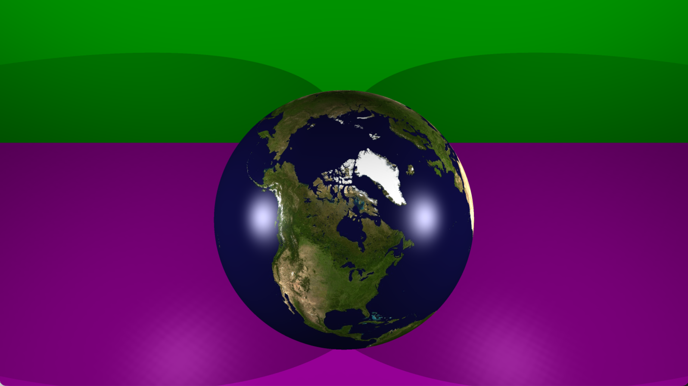
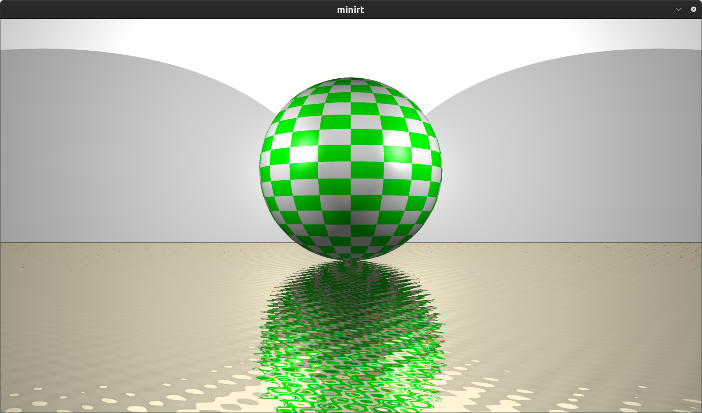
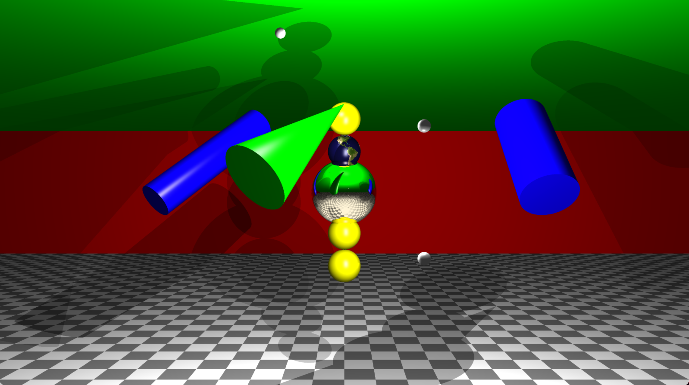
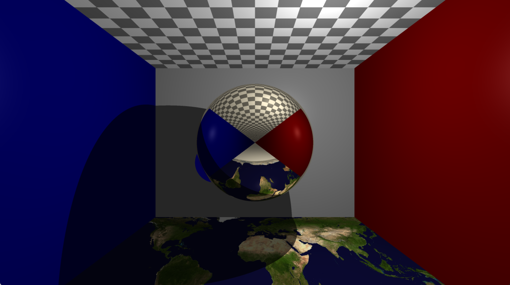
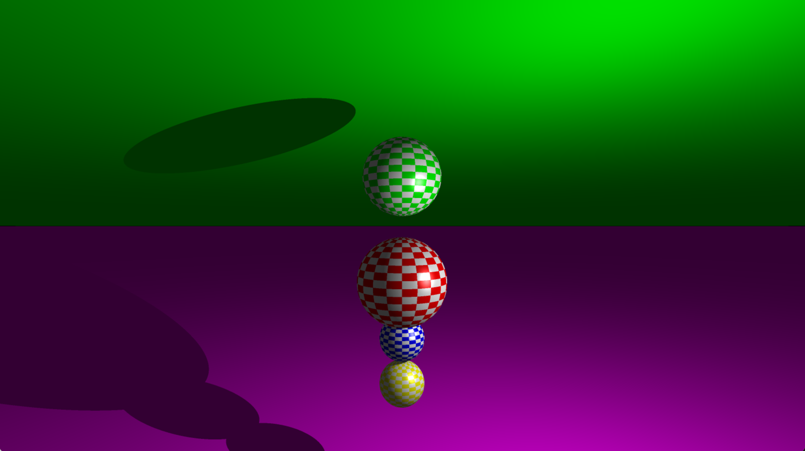

*This project has been created as part of the 42 curriculum by yotsurud, tamatsuu.*

## Overview
  - [Description](#description)
  - [Instructions](#instructions)
  - [Resources](#resources)
  - [Feature List](#feature-list)
  - [Implementation Details](#implementation-details)
  - [RT File_Sample](#rt-file-sample)
  - [Parameter Regulation](#parameter-regulation)
  - [Examples](#examples)

---

## Description

  The goal of project is to generate images using the Raytracing protocol. Those computer-generated images will each represent a scene, as seen from a specific angle and position, defined by simple geometric objects, and each with its own lighting system.

---

## Instructions

### Installations

  - `git clone <repository of this project>`<br>
  - `cd project-name`

### Download minilibx

  - `Download the MiniLibX files from the project page and place them in the root directory of this project.`

### Compilation

  - `make`<br>
  - `make bonus`

### Run

  - `./miniRT scene/<filename>.rt`<br>
  - `./miniRT_bonus scene/<filename>.rt`

### Close window

  - `ESC button`<br>
  - `Click the window close button.`<br>
  - `ctrl-C`

---

## Resources
  - https://inzkyk.xyz/ray_tracing_in_one_weekend/
  - https://jun-networks.hatenablog.com/entry/2021/04/02/043216
  - https://www.youtube.com/watch?v=RIgc5J_ZGu8&list=PLAqGIYgEAxrUO6ODA0pnLkM2UOijerFPv

---

## Feature List

  - Mandatory part
	  - Ambient lighting
	  - Camera
	  - Light
	  - Sphere
	  - Plane
	  - Cylinder
    - Rendiering Techniqued
      - Epsilon Offset
  - Bonus part
	  - Full Phong reflection model
	  - Checkerboard pattern
	  - Colored and multi-spot lights
	  - Cone
	  - Bump mapping
  - Additional Features
	  - Anti-Aliasing
	  - Image Texture
	  - Light Attenuation
	  - Roughness

---

## Implementation Details

### Mandatory Part
  The rendering process follows a standard ray tracing pipeline:
  rays are cast from the camera through each pixel, intersections are computed, and lighting is applied based on surface normals and light sources.

`Key: Ray → Hit → Normal → Lighting`

#### Ambient Lighting
  - Provides a constant base illumination applied to all objects, ensuring that surfaces are visible even without direct light.

#### Camera
  - Defines the viewpoint and generates rays through each pixel based on position, orientation, and field of view.

#### Light
  - Represents a point light source used to compute shading based on the angle between the light direction and the surface normal.

#### Sphere
  - Intersection is computed by solving a quadratic equation derived from the ray-sphere equation.

#### Plane
  - Intersection is computed using a linear equation based on the plane normal and ray direction.

#### Cylinder
  - Intersection is computed using a quadratic equation for the curved surface, with additional checks to validate the height and caps.

### Epsilon Offset
  - A small offset applied to ray origins to avoid self-intersection caused by floating-point errors.

---

### Bonus Part

  Additional features were implemented to enhance visual realism and extend the basic ray tracing functionality.

#### Full Phong Reflection Model
  - Implements a complete lighting model by combining ambient, diffuse, and specular components to simulate realistic surface shading.

#### Checkerboard Pattern
  - Generates procedural patterns on surfaces by alternating colors based on spatial coordinates.

#### Multiple Lights
  - Supports multiple light sources, with each contributing independently to the final color.

#### Cone
  - Adds support for cone geometry, including intersection tests and normal computation.

#### Bump Map
  - Simulates surface detail by perturbing the normal vector based on a texture or procedural function without modifying geometry.

---

## Additional Features

### Anti-Aliasing
  - Multiple rays are cast per pixel and averaged to reduce jagged edges. Random sampling improves visual smoothness.
    - Key: 1 pixel = average

### Image Texture
  - Surface points are mapped to UV coordinates to fetch colors from an image. Texture color replaces object color.
    - Key: UV mapping

### Light Attenuation
  - Light intensity decreases with distance from the source. This adds depth and realism to the scene.
    - Key: 1 / d²

### Roughness
  - Reflection direction is slightly randomized to simulate imperfect surfaces. Higher roughness results in blurrier reflections.
    - Key: blur reflection

---

## RT File Sample
```bash
# Ambient light
## ratio     rgb
A  0.1       255,255,255

# Camera
## xyz       vector       degree                
C  0,-5,-60  0,0,1        40

# Light
## xyz       ratio        rgb
L  15,15,-15 0.5          255,255,255

# Sphere
## xyz       diameter     rgb          mat & tex  bump    filename			
sp -15,0,0   20           255,0,0	     metal      ON      NONE
sp 0,0,0     10           255,0,0

# Plane
## xyz       vector       rgb	
pl 0,-20,0   0,1,0        0,255,0

# Cylinder
## xyz       vector       diameter     height     rgb	
cy 10,0,0    0,1.0,0.0    7.2          21.42      0,0,255

# Cone
## xyz       vector       diameter     height     rgb	
cn -15,0,0   1.0,0.0,0.0  7.2          21.42      255,0,255
```

---

## Parameter Regulation

  The following features are supported only for specific object types:

  - Checker pattern, image texture, and bump mapping:
    - Supported on spheres
    - Supported on horizontal planes with normals:
      - (0, 1, 0) or (0, -1, 0)

  - Full Phong reflection model:
    - Supported on selected object types (e.g. planes and spheres)

  These constraints simplify UV mapping and ensure stable rendering.

---

## Examples

### [Mandatory part] ###
  - ### Simple Scene
<p align="center">
  <br>
  <em>Sphere</em>
</p>

  - ### Ambient Light
<p align="center">
  <br>
  <em>Ambient</em>
</p>

  - ### Light Position
<p align="center">
 
 <br>
 <em>Front and Back</em>
</p>
<p align="center">
 
 <br>
 <em>Top and Bottom</em>
</p>
<p align="center">
 
 <br>
 <em>Left and Right</em>
</p>
<p align="center">
 <br>
 <em>Inside</em>
</p>

  - ### Objects [Mandatory part]

<p align="center">
  <br>
  <em>Sphere</em>
</p>

<p align="center">
  <br>
  <em>Plane</em>
</p>

<p align="center">
  
  <br>
  <em>Cylinder</em>
</p>

### [Bonus part] ###

  - ### Full Phong reflection model
<p align="center">
  <br>
</p>

  - ### Checker
<p align="center">
  <br>
</p>

  - ### Multi spot-lights
<p align="center">
  <br>
</p>

  - ### Cone
<p align="center">
  <br>
</p>

  - ### Bumps Mapping
<p align="center">
  <br>
  <em>Earth image with bump mapping</em><br><br>
  <br>
  <em>Earth image without bump mapping</em><br><br>
  <br>
  <em>Specular reflection with roughness</em>
</p>
 
### Mixed
<p align="center">
 <br><br>
 <br><br>
 <br><br>
 <br><br>
 <br><br>
 <br><br>
 <br><br>
</p>
